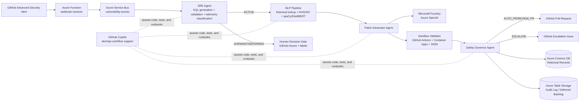

# Sentinel-D: Autonomous Vulnerability Remediation Pipeline

Sentinel-D is an end-to-end DevSecOps system that converts real GitHub Advanced Security (GHAS) alerts into validated remediation actions.

It solves the operational gap between **detection** and **safe fix delivery** by combining telemetry-aware prioritization, ML-assisted patch generation, sandbox validation, and policy-based governance.

## What Sentinel-D Does

- Receives GHAS vulnerability alerts through Azure Functions.
- Prioritizes alerts using production telemetry (`ACTIVE`, `DORMANT`, `DEFERRED`) with the SRE Agent.
- Builds fix context using NVD + Stack Overflow + local ML models (spaCy NER, DistilBERT).
- Generates candidate patches using Microsoft Foundry (Azure OpenAI) and replay paths for historical matches.
- Validates patches in sandboxed execution with tests and SSIM visual checks.
- Applies Safety Governor policy to create PRs, escalate to issues, or archive.
- Writes historical outcomes to Cosmos DB for faster, better future handling.

## Core Features

- **Schema-driven contracts** across stages (`shared/schemas/*.json`).
- **Telemetry-driven triage** before expensive remediation work.
- **LLM-assisted patching** with confidence scoring and hard safety constraints.
- **Human decision gate** labels (`sentinel/fix-now`, `sentinel/defer`, `sentinel/wont-fix`).
- **Auditability** via append-only records and historical resolution storage.

## High-Level Flow

```text
GHAS Alert
  -> Azure Function (webhook receiver)
  -> Service Bus (vulnerability-events)
  -> SRE Agent (KQL + App Insights -> ACTIVE/DORMANT/DEFERRED)
  -> NLP Pipeline (historical lookup + NVD/SO + ML intent)
  -> Patch Generator (Foundry / replay)
  -> Sandbox Validator (tests + SSIM)
  -> Safety Governor (AUTO_PR / REVIEW_PR / ESCALATE / ARCHIVE)
  -> Historical DB write (Cosmos DB)
```

## Architecture Diagram



## Updated Repository Structure

```text
azure-functions/
  webhook-receiver/        # GHAS webhook -> schema validate -> Service Bus
  dead-letter-handler/     # Reprocess dead-lettered queue messages

sre-agent/                 # Telemetry triage (KQL, validation, classification, routing)
nlp-pipeline/              # Historical lookup, fetchers, NER + intent classification
patch-generator/           # Foundry clients/wrappers + patch generation tests
sandbox-validator/         # Sandbox workflow orchestration + SSIM tooling
safety-governor/           # Policy router, PR creation, escalation, human handlers
historical-db/             # Cosmos/Table clients (write path + deferred backlog)
shared/                    # Shared retry utilities + frozen JSON schemas

infrastructure/            # Logic Apps + provisioning scripts
scripts/                   # Integration/stress scripts
demo/                      # Vulnerable demo app for live pipeline tests
docs/                      # Supporting docs and test artifacts
agents/patch_generator/    # Canonical Python patch-generation agent modules
```

## Technology Stack

- **Languages:** Python, Node.js
- **AI/ML:** Microsoft Foundry (Azure OpenAI), spaCy, DistilBERT, PyTorch
- **Azure Services:** Functions, Service Bus, Application Insights, Container Apps Jobs, Cosmos DB, Table Storage, Logic Apps
- **GitHub Platform:** GHAS, Actions, Issues, Pull Requests, Labels
- **Validation Tooling:** Puppeteer, scikit-image (SSIM), pytest, Jest

## Setup (Corrected)

### Prerequisites

- Node.js 20+
- Python 3.11+
- Azure CLI and authenticated Azure session
- GitHub CLI (`gh`) authenticated
- Azure Functions Core Tools (for local Function app runs)

### 1) Clone

```bash
git clone https://github.com/BilalAsifB/Sentinel-d.git
cd Sentinel-d
```

### 2) Python environment

```bash
python3 -m venv .venv
source .venv/bin/activate
pip install -r requirements.txt
pip install -r sre-agent/requirements.txt
pip install -r sandbox-validator/requirements.txt
```

### 3) Node dependencies (component-level)

```bash
cd azure-functions/webhook-receiver && npm ci && cd ../..
cd azure-functions/dead-letter-handler && npm ci && cd ../..
cd historical-db && npm ci && cd ..
cd safety-governor && npm ci && cd ..
cd patch-generator && npm ci && cd ..
cd sandbox-validator && npm ci && cd ..
cd shared && npm ci && cd ..
```

### 4) Environment configuration

Configure environment variables (for local execution and cloud auth), including:

- `SERVICE_BUS_NAMESPACE`
- `SERVICE_BUS_QUEUE_NAME`
- `APP_INSIGHTS_WORKSPACE_ID`
- `COSMOS_DB_ENDPOINT` (or `COSMOS_ENDPOINT`)
- `COSMOS_DB_DATABASE` / `COSMOS_DB_CONTAINER`
- `GITHUB_TOKEN`, `GITHUB_OWNER`, `GITHUB_REPO`
- `AZURE_OPENAI_ENDPOINT` / `FOUNDRY_ENDPOINT`
- `AZURE_OPENAI_API_KEY` (or AAD credentials)

## Test Commands (Current)

```bash
# Webhook receiver
cd azure-functions/webhook-receiver && npm test

# Dead-letter handler
cd azure-functions/dead-letter-handler && npm test

# SRE Agent
cd sre-agent && python3 -m pytest tests/ -v

# Patch Generator
cd patch-generator && npm test

# Sandbox Validator
cd sandbox-validator && npm test
cd sandbox-validator && python3 -m pytest tests/ -v

# Safety Governor
cd safety-governor && npm test

# Historical DB
cd historical-db && npm test

# Shared utilities
cd shared && npm test
```

## Interface Contracts

The stage interfaces are defined in `shared/schemas/` and are treated as frozen contracts:

- `webhook_payload.json`
- `telemetry_classification.json`
- `structured_context.json`
- `candidate_patch.json`
- `validation_bundle.json`
- `historical_match.json`
- `historical_db_record.json`
- `human_decision.json`

## License

MIT
